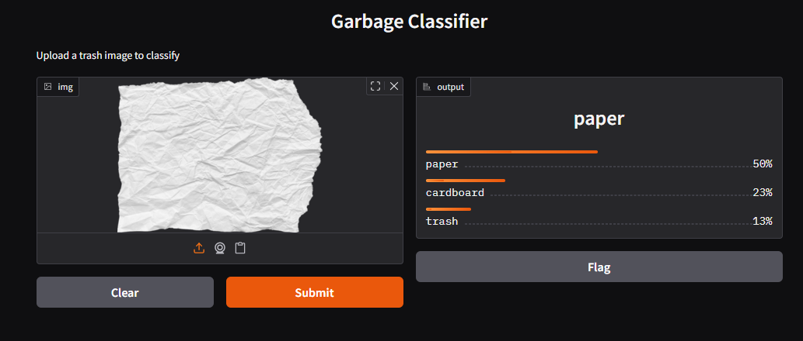

# Garbage Classification - Final Week
This project is part of the AICTE Internship for building a smart garbage classifier using Transfer Learning.

# Final Week Changes
- Fine-tuned MobileNetV2 by unfreezing deeper layers to boost accuracy
- Applied improved image augmentation and learning rate scheduling
- Added EarlyStopping and ModelCheckpoint for better generalization
- Retrained and achieved better validation accuracy
- Evaluated with external trash images and visualized results
- Finalized interactive Gradio UI linked to saved model
- Cleaned and organized code for submission

# Gradio Demo Screenshot
This UI allows users to upload trash images and classify them in real-time:
Cardboard

Plastic

Trash

Paper

Metal

Glass

